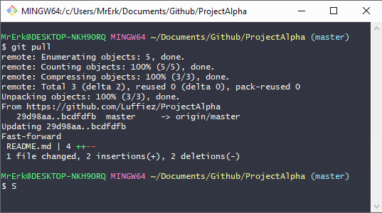
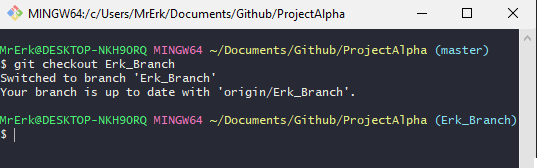

# Github workflow

## Get and merge updates into your local branch
- Fetch updates using `git pull`.
- Make sure you are in your branch, if not, use `git checkout YourBranchName`.
- Merge master content into your branch using `git merge origin/master`.
- when prompted, complete merge by typing :wq (write & quit) then enter.

## Send U

## Fetch updates
**Command**: `Git pull`

## Navigating between branches
> Git checkout BranchName

## Create your own branch to using the following command
> Git checkout *-b YourBranchName* 

## Check status of branch
Checks the status of the active branch, shows what has been changed, added and commited.
> Git status

